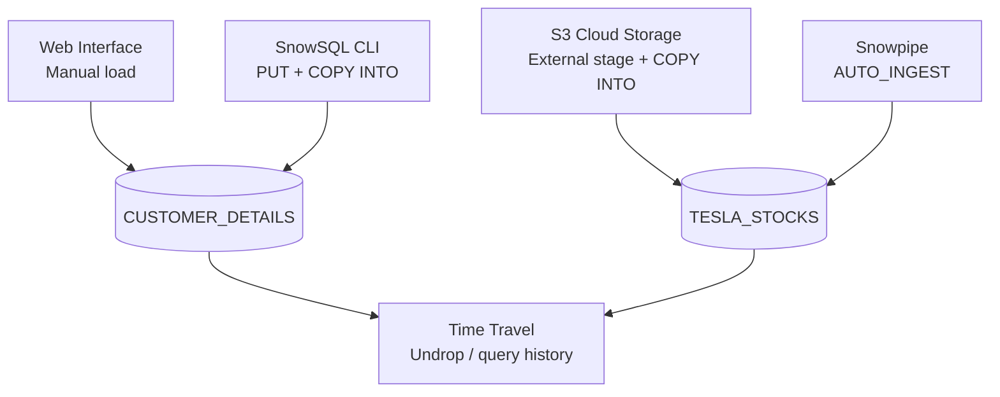

  
  
  
  

<h1 align="center">Snowflake Data Loading Examples</h1>

  This project demonstrates different ways to load data into Snowflake using SQL commands,
  SnowSQL (CLI), cloud storage, and Snowpipe. It also covers external stages, storage
  integrations, and Snowflake features like Time Travel.

  
  
  

---

## Overview

## 1. Load Data using Web Interface

See `queries/01_load_via_web_interface.sql`.

- Create a new database `PROJECT_DB`.
- Create a table `CUSTOMER_DETAILS`.
- Load data manually into the table through the Snowflake web UI.
- Verify with a `SELECT *` query.

## 2. Load Data using SnowSQL (CLI)

See `queries/02_load_via_snowcli.sql`.

- Create a file format for CSV files.
- Create a stage and upload (`PUT`) local files.
- Use `COPY INTO` to load staged files into `CUSTOMER_DETAILS`.
- Supports file patterns (`*.csv.gz`) for multiple files.

## 3. Load Data from Cloud Storage (S3)

See `queries/03_load_via_cloud_provider.sql`.

- Create a table `TESLA_STOCKS` for stock data.
- Create an external stage pointing to an S3 bucket.
- Use `COPY INTO` to bulk load CSV data from S3.
- Example includes both direct credentials and Storage Integrations with IAM Role + Policy.

## 4. Load Data using Snowpipe

See `queries/04_load_via_snowpipe.sql`.

- Configure storage integration for S3.
- Create an external stage for Tesla stock data.
- Create a Snowpipe with `AUTO_INGEST=TRUE` to continuously load new files.
- Validate using `SHOW PIPES` and query the table.

## 5. Time Travel

See `queries/05_time_travel.sql`.

- Demonstrates Snowflake's Time Travel:
  - Drop and undrop tables.
  - Query table data before an update using statement IDs.

## Key Features Covered

| Area | Covered |
|---|---|
| Database & table creation | ✅ |
| Web UI data load | ✅ |
| SnowSQL CLI (`PUT`, `COPY INTO`) | ✅ |
| External stage with S3 | ✅ |
| Storage integrations with IAM role | ✅ |
| Snowpipe for automated ingestion | ✅ |
| Time Travel (restore dropped tables, query historical data) | ✅ |

## How to Use

1. Run the SQL commands step by step in a Snowflake Worksheet or SnowSQL.
2. Update the S3 bucket name, IAM role ARN, and credentials before running the cloud/Snowpipe sections.
3. Use the provided `customer_detail.csv` and `TSLA.csv` as sample data.

## References

- [Snowflake Data Loading Guide](https://docs.snowflake.com/en/user-guide-data-load)
- [Snowpipe Documentation](https://docs.snowflake.com/en/user-guide/data-load-snowpipe)
- [Time Travel in Snowflake](https://docs.snowflake.com/en/user-guide/time-travel)

---

  Built with Snowflake, AWS S3, SQL, SnowSQL

